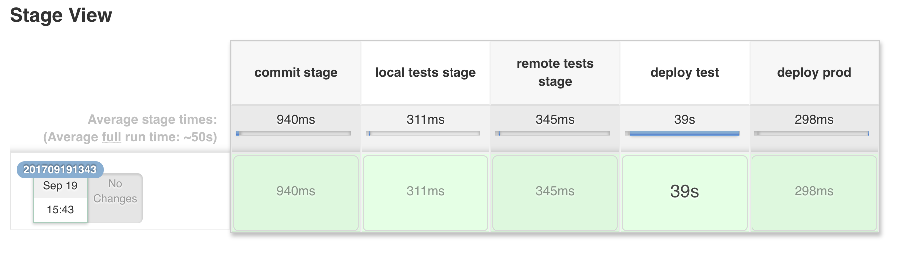

# Infrastructure as Code Demo
This repo contains resources used to provide demo for Infrastructure as Code concept using **Jenkins pipelines** with testing, stages, artifacts and all good practices.



# Components 
In the pipeline the following components have been used:
  * **Terraform** - for provisioning infrastructure part on AWS
  * **Ansible** - for provisioning host/os layer
  * **test-kitchen** - for automated tests for ansible code (and terraform in some future)
  * **Jenkins** - for orchestrating deployments with pipeline created from code
    included in this repo

# Usage

  * First launch jenkins using custom image (with required plugins)

  ```
  cd jenkins
  docker-compose up -d
  ```

  * After built is complete and your container is running you can point your browser to [http://localhost:8888](http://localhost:8888) to verify it.

  * Create jobs using command line

  ```
  ./load-seed.sh
  ```

  * Prepare your ssh keys - generate new ones or use existing (required for Ansible)
    * Paste **public** key in **tf/variables.tf**
    * Paste **private** key in **~/.ssh/id_rsa** inside jenkins container \

    ```
    docker cp ~/.ssh/keys/iac-demo jenkins_jenkins_1:/var/jenkins_home/.ssh/id_rsa
    docker exec -ti -u root jenkins_jenkins_1 chown jenkins:jenkins /var/jenkins_home/.ssh/id_rsa
    ```


  * Configure AWS credentials on jenkins
    * Go to **Credentials->Jenkins->Global Credentials**
    * **Add credentials**
    * Provide your **AWS_ACCESS_KEY_ID** as **Username** and **AWS_SECRET_ACCESS_KEY** as **Password**
    * Type **aws-keys** as **ID** in the form

  * Create AWS resources for Terraform's shared state using S3 bucket and single
    DynamoDB table
    * Use code from **tf/aws-state-init/**
    
    ```
    cd tf/aws-state-init/; terraform apply
    ```

  * Launch pipeline by running a job **terraform-aws-vpc-pipeline**
    * On the first run it will fail, because of Jenkins built-in security, just go to **Manage Jenkins -> In-process Script Approval** and approve script
    * Before actual deployment on AWS it will ask for permission.

    

